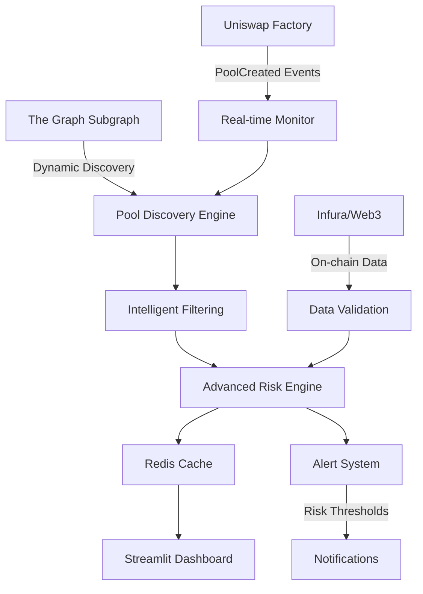

# Dynamic Uniswap V3 Risk Dashboard

A comprehensive, real-time monitoring system that **automatically discovers and analyzes all available Uniswap V3 liquidity pools** with advanced risk assessment capabilities.

## Key Features

### **Dynamic Pool Discovery**
- **Automatic Detection**: Discovers all Uniswap V3 pools above configurable thresholds
- **Real-time Updates**: Continuously monitors for new pool creations
- **Intelligent Filtering**: Filters out dust pools and invalid tokens
- **Scalable Architecture**: Handles 1000+ pools with pagination support

### **Advanced Risk Analysis**
- **Multi-Dimensional Risk Scoring**: 4 comprehensive risk categories
  - **Liquidity Risk**: TVL volatility, concentration, depth analysis
  - **Market Risk**: Price impact, impermanent loss probability
  - **Operational Risk**: Fee efficiency, transaction frequency, pool maturity
  - **Systemic Risk**: Token ecosystem health, cross-pool dependencies
- **Real-time Alerts**: Automated risk threshold monitoring
- **Historical Analysis**: Volume stability and trend analysis

### **Professional Dashboard**
- **Interactive Visualizations**: Risk heatmaps, distribution charts, trend analysis
- **Advanced Filtering**: Filter by TVL, risk level, volume, and more
- **Real-time Updates**: Configurable refresh intervals (60-600 seconds)
- **Risk Heatmap**: Visual representation of all risk components
- **Top/Safest Pools**: Automated identification of highest risk and safest pools

### **Enterprise-Grade Features**
- **Redis Caching**: High-performance data storage and retrieval
- **Error Handling**: Robust fallback mechanisms and error recovery
- **Rate Limiting**: Intelligent API usage management
- **Monitoring**: Real-time pool creation detection and alerting

## Architecture



## Risk Analysis Framework

### **Risk Components**
1. **Liquidity Risk (25%)**
   - TVL volatility (EWMA-based)
   - Liquidity depth vs volume ratio
   - Pool size concentration

2. **Market Risk (30%)**
   - Price impact calculations
   - Impermanent loss probability
   - Volume stability analysis

3. **Operational Risk (20%)**
   - Fee tier efficiency
   - Transaction frequency
   - Pool maturity assessment

4. **Systemic Risk (25%)**
   - Token ecosystem health
   - Cross-pool dependencies
   - Market cap correlations

### **Risk Levels**
- Low Risk (0.0-0.3): Excellent risk profile
- Medium Risk (0.3-0.6): Moderate risk with acceptable volatility
- High Risk (0.6-0.8): Elevated risk requiring monitoring
- Critical Risk (0.8-1.0): High risk - use with extreme caution

## Tech Stack
- **Python 3.8+**: Core application logic
- **The Graph**: Subgraph API for pool data
- **Web3.py**: Blockchain interaction and event monitoring
- **Redis**: High-performance caching and data persistence
- **Streamlit**: Interactive dashboard and visualizations
- **Plotly**: Advanced charting and risk heatmaps
- **Pandas**: Data processing and analysis
- **Asyncio**: Asynchronous data fetching and processing

## Quick Start

### Prerequisites
- Python 3.8+
- Redis server
- Infura API key (optional, uses public subgraph by default)

### Installation
```bash
# Clone the repository
git clone https://github.com/Dairus01/uniswap_v3_risk_tracker.git
cd defi-risk-dashboard

# Install dependencies
pip install -r requirements.txt

```

### Configuration
Create a `.env` file in the project root:
```env
# Blockchain connections (optional - uses public subgraph by default)
INFURA_URL=https://mainnet.infura.io/v3/YOUR_INFURA_KEY

# Redis configuration
REDIS_HOST=localhost
REDIS_PORT=6379
REDIS_DB=0

# Optional: Custom subgraph (uses official Uniswap V3 subgraph by default)
subgraph_api_key=your_graph_api_key
subgraph_id=your_subgraph_id
```

### Running the Dashboard
```bash
streamlit run src/dashboard.py
```

The dashboard will be available at `http://localhost:8501`

## Dashboard Features

### **Dynamic Discovery Mode**
- Automatically discovers all Uniswap V3 pools
- Configurable minimum TVL threshold ($1K - $10M)
- Intelligent filtering of invalid/dust pools
- Real-time pool creation monitoring

### **Advanced Filtering**
- Filter by TVL range
- Filter by risk level (Low/Medium/High/Critical)
- Filter by volume and activity
- Limit number of pools for performance

### **Risk Visualizations**
- **Risk Distribution Pie Chart**: Shows distribution of risk levels
- **Risk Heatmap**: Visual representation of risk components
- **Pool Analysis Table**: Comprehensive pool metrics
- **Top Risky/Safest Pools**: Automated risk ranking

### **Real-time Monitoring**
- Configurable refresh intervals (60-600 seconds)
- Automatic data updates
- Error handling and fallback mechanisms
- Performance optimization for large datasets

## Performance & Scalability

### **Optimizations**
- **Pagination**: Handles 1000+ pools efficiently
- **Caching**: Redis-based data persistence
- **Async Processing**: Non-blocking data fetching
- **Intelligent Filtering**: Reduces data processing overhead

### **Rate Limiting**
- Respects The Graph API limits
- Intelligent retry mechanisms
- Fallback to legacy mode on errors

### **Memory Management**
- Streaming data processing
- Configurable pool limits
- Efficient data structures

## Configuration Options

### **Pool Discovery Settings**
```python
POOL_DISCOVERY_CONFIG = {
    "min_tvl_usd": 10000,      # Minimum TVL threshold
    "min_tx_count": 100,       # Minimum transaction count
    "max_pools": 1000,         # Maximum pools to analyze
    "batch_size": 1000,        # Batch size for pagination
    "update_interval": 300,    # Update interval (seconds)
}
```

### **Risk Analysis Weights**
```python
RISK_CONFIG = {
    "risk_weights": {
        "liquidity_risk": 0.25,    # TVL volatility, concentration
        "market_risk": 0.30,       # Price impact, impermanent loss
        "operational_risk": 0.20,  # Fee efficiency, transaction frequency
        "systemic_risk": 0.25,     # Token ecosystem health
    }
}
```

## Alert System (optional)

### **Risk Alerts**
- **Critical Risk**: Pools with risk score > 0.8
- **High Risk**: Pools with risk score > 0.6
- **Volume Anomalies**: Extreme volume/TVL ratios
- **Volatility Alerts**: High TVL volatility detection

### **Real-time Monitoring**
- Pool creation detection
- Risk threshold monitoring
- Performance alerts
- System health monitoring

## Migration from Legacy System

The system maintains backward compatibility with the original hardcoded pool approach:

1. **Legacy Mode**: Use the original 3 hardcoded pools
2. **Dynamic Mode**: Automatically discover all pools (default)
3. **Hybrid Mode**: Combine both approaches

Switch between modes using the dashboard sidebar controls.

## Data Sources

### **Primary Sources**
- **The Graph Uniswap V3 Subgraph**: Official, public subgraph
- **Infura**: Ethereum mainnet access (optional)
- **Redis**: Local caching and persistence

### **Data Validation**
- Cross-reference subgraph data with on-chain data
- Validate token information and pool metadata
- Filter out invalid or suspicious pools

## Contributing

1. Fork the repository
2. Create a feature branch
3. Make your changes
4. Add tests if applicable
5. Submit a pull request

## License

This project is licensed under the MIT License - see the LICENSE file for details.

## Support

For issues, questions, or contributions:
- Create an issue on GitHub
- Check the documentation
- Review the configuration options

---

Built for the DeFi community
